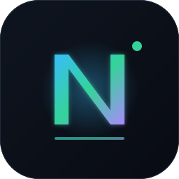
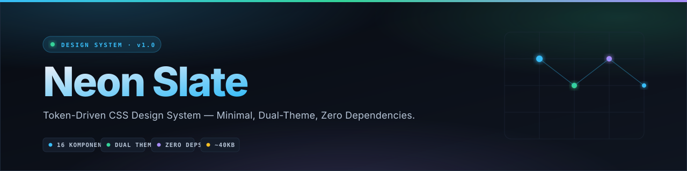

<p align="center">
  
</p>

<h1 align="center">Neon Slate</h1>

<p align="center">
  <strong>Token-Driven CSS Design System</strong> — Minimal, Dual-Theme, Zero Dependencies.
</p>

<p align="center">
  
</p>

<p align="center">
  <a href="#installation"></a>
  <a href="#license"></a>
  
</p>

<p align="center">
  
</p>


## 📖 Table of Contents

- [About](#-about)
- [Features](#-features)
- [File Structure](#-file-structure)
- [Installation](#-installation)
- [Design Tokens](#-design-tokens)
- [Components](#-components)
- [Theme Switching](#-theme-switching)
- [Browser Support](#-browser-support)
- [Naming Conventions](#-naming-conventions)
- [Changelog](#-changelog)
- [License](#-license)

## 🎯 About

**Neon Slate** is a minimal design system built on top of CSS custom properties (variables). It is designed for:

- Technical dashboards & data-dense UI
- API documentation / developer tools
- Portfolio & showcase
- Rapid prototyping with a modern aesthetic

Core principle: **consistency > creativity per-component**. Every color, spacing, radius, and typography value comes from a token. Need a new value? → add a token, not a one-off style.

## ✨ Features

| Feature | Description |
|---|---|
| 🎨 **Dual theme** | Dark & light via `[data-theme]` — no CSS duplication |
| 🧩 **16 components** | Button, form, modal, toast, stepper, tabs, accordion, tooltip, timeline, etc. |
| 📐 **Token-driven** | All values come from CSS variables — change theme = edit one place |
| ♿ **Accessible** | `:focus-visible`, `prefers-reduced-motion`, semantic HTML |
| 📱 **Responsive** | 3 breakpoints: desktop / tablet (980px) / mobile (640px) |
| 🪶 **Zero dependencies** | Pure CSS, no framework or build tool |
| ⚡ **Lightweight** | ~40KB unminified, ~8KB gzipped |

## 📁 File Structure

```
CSS - Neon Slate/
├── Neon_Slate_CSS.html      ← Showcase of all components
├── README.md                ← This documentation
└── css/
    ├── tokens.css           ← Design tokens (colors, spacing, etc.)
    ├── base.css             ← Reset + element defaults
    ├── components.css       ← All UI components
    └── utilities.css        ← Helper classes (single-purpose)
```

**Mandatory load order** (do not change):

```html
<link rel="stylesheet" href="css/tokens.css">
<link rel="stylesheet" href="css/base.css">
<link rel="stylesheet" href="css/components.css">
<link rel="stylesheet" href="css/utilities.css">
```

## 🚀 Installation

### 1. Download / Clone

Copy the `css/` folder and the `Neon_Slate_CSS.html` file into your project:

```
your-project/
├── index.html
└── css/
    ├── tokens.css
    ├── base.css
    ├── components.css
    └── utilities.css
```

### 2. Include in HTML

Add the 4 CSS files to `<head>` — **order matters**:

```html
<!DOCTYPE html>
<html lang="en" data-theme="dark">
<head>
  <meta charset="UTF-8">
  <meta name="viewport" content="width=device-width, initial-scale=1.0">
  <title>My App</title>

  <!-- Fonts (optional but recommended) -->
  <link rel="preconnect" href="https://fonts.googleapis.com">
  <link rel="preconnect" href="https://fonts.gstatic.com" crossorigin>
  <link href="https://fonts.googleapis.com/css2?family=Inter:wght@400;500;600;700;800&family=JetBrains+Mono:wght@400;500;600&display=swap" rel="stylesheet">

  <!-- Neon Slate — do not change the order -->
  <link rel="stylesheet" href="css/tokens.css">
  <link rel="stylesheet" href="css/base.css">
  <link rel="stylesheet" href="css/components.css">
  <link rel="stylesheet" href="css/utilities.css">
</head>
<body>
  <!-- Your content here -->
</body>
</html>
```

### 3. Quick Usage Example

```html
<!-- Button -->
<button class="btn btn--primary">Save Changes</button>

<!-- Callout -->
<div class="callout callout--success">
  <div class="callout__title">✓ Success</div>
  <p>Data saved successfully.</p>
</div>

<!-- Badge -->
<span class="badge badge--accent">● Active</span>

<!-- Interactive card -->
<div class="card card--interactive">
  <h3>Card Title</h3>
  <p>Short card description.</p>
</div>
```

### 4. Theme Toggle (Optional)

To let users switch themes, add this minimal script:

```html
<button class="icon-btn" id="themeToggle">🌓 Toggle Theme</button>

<script>
  const root = document.documentElement;
  const saved = localStorage.getItem('theme')
    || (matchMedia('(prefers-color-scheme: light)').matches ? 'light' : 'dark');
  root.setAttribute('data-theme', saved);

  document.getElementById('themeToggle').addEventListener('click', () => {
    const next = root.getAttribute('data-theme') === 'dark' ? 'light' : 'dark';
    root.setAttribute('data-theme', next);
    localStorage.setItem('theme', next);
  });
</script>
```

Done — you're ready to build UI with Neon Slate. 🎉

## 🎨 Design Tokens

All tokens are defined in `tokens.css`. Never hardcode values — always reference the tokens below.

### Semantic Colors

| Token | Dark | Light | Function |
|---|---|---|---|
| `--accent` | `#38bdf8` | `#0284c7` | Primary action, link, focus |
| `--accent-2` | `#34d399` | `#059669` | Success, positive value |
| `--warn` | `#fbbf24` | `#b45309` | Warning |
| `--danger` | `#fb7185` | `#e11d48` | Error, danger |
| `--purple` | `#a78bfa` | `#7c3aed` | Special info, secondary accent |
| `--muted` | `#7d8fa8` | `#64798f` | Secondary text / disabled |

### Surface & Background

| Token | Dark | Light | Function |
|---|---|---|---|
| `--bg` | `#080b12` | `#f5f8fc` | Page background |
| `--surface` | `#0f1520` | `#ffffff` | Card, modal |
| `--surface-2` | `#141c2a` | `#f2f6fb` | Input, hover state |
| `--surface-3` | `#1a2434` | `#e9f0f8` | Track, disabled |
| `--border` | `#1f2b3d` | `#d8e2ee` | Primary border |
| `--border-soft` | `#17202e` | `#e6edf5` | Soft border |

### Text

| Token | Function |
|---|---|
| `--text` | Primary text |
| `--text-2` | Secondary text (paragraph) |
| `--muted` | Caption, small label |

### Typography

| Token | Value | Function |
|---|---|---|
| `--font-sans` | `Inter, ...` | UI text |
| `--font-mono` | `JetBrains Mono, ...` | Numbers, code, IPs |
| `--fs-xs` | `0.72rem` | Label, eyebrow |
| `--fs-sm` | `0.82rem` | Caption, chips |
| `--fs-base` | `0.93rem` | Body text |
| `--fs-md` | `1.06rem` | Subheading |
| `--fs-lg` | `1.35rem` | Heading h3 |
| `--fs-xl` | `1.8rem` | Heading h2 |
| `--fs-2xl` | `clamp(2rem, 5.2vw, 3.4rem)` | Hero |

### Spacing (8pt Grid)

| Token | Value | Token | Value |
|---|---|---|---|
| `--sp-1` | 4px | `--sp-5` | 20px |
| `--sp-2` | 8px | `--sp-6` | 24px |
| `--sp-3` | 12px | `--sp-8` | 32px |
| `--sp-4` | 16px | `--sp-10` | 40px |

### Radius

| Token | Value | Function |
|---|---|---|
| `--r-sm` | 8px | Small chip, badge |
| `--r-md` | 10px | Input, button |
| `--r-lg` | 16px | Card, modal |
| `--r-pill` | 99px | Pill button |

### Transitions

| Token | Value | Function |
|---|---|---|
| `--ease-out` | `cubic-bezier(0.16, 1, 0.3, 1)` | Entrance animation |
| `--ease-soft` | `cubic-bezier(0.4, 0, 0.2, 1)` | Micro-interaction |
| `--dur-fast` | 0.2s | Hover |
| `--dur-mid` | 0.3s | Toggle |
| `--dur-slow` | 0.38s | Expand / collapse |

### Usage Example

```css
.my-custom-card {
  background: var(--surface);
  border: 1px solid var(--border);
  border-radius: var(--r-lg);
  padding: var(--sp-6);
  color: var(--text);
  transition: border-color var(--dur-mid) var(--ease-soft);
}
.my-custom-card:hover {
  border-color: color-mix(in srgb, var(--accent) 35%, var(--border));
}
```

## 🧩 Components

Neon Slate ships with 16+ ready-to-use components. See `Neon_Slate_CSS.html` for interactive demos of each component.

### Component List

| # | Component | Main Class | Variants |
|---|---|---|---|
| 01 | **Swatch** | `.swatch` | — |
| 02 | **Typography** | `.type-row` | — |
| 03 | **Button** | `.btn` | `.btn--primary`, `.btn--ghost`, `.icon-btn` |
| 04 | **Badge** | `.badge` | `.badge--accent`, `--success`, `--warn`, `--danger`, `--purple` |
| 05 | **Card** | `.card` | `.card--interactive` |
| 06 | **Callout** | `.callout` | `.callout--success`, `--warn`, `--danger`, `--purple` |
| 07 | **Code Block** | `.code-block` | Syntax highlighting via `.tok-*` |
| 08 | **Table** | `.table-wrap` + `.table` | — |
| 09 | **Form** | `.field`, `.input`, `.textarea`, `.select` | `.check`, `.switch` |
| 10 | **Accordion** | `.acc`, `.acc-item` | Single-open via JS |
| 11 | **Tabs** | `.tabs`, `.tab-list`, `.tab-btn` | `.tab-panel` |
| 12 | **Stepper** | `.stepper`, `.chips`, `.step` | `.step-label`, `.step-footer` |
| 13 | **Flow Diagram** | `.flow-wrap`, `.flow-track` | `.node--accent`, `--success`, `--warn`, `--purple` |
| 14 | **Stat Grid** | `.stat-grid`, `.stat` | `.stat__k`, `.stat__v` |
| 15 | **Timeline** | `.chain`, `.chain-item` | `.chain-num`, `.chain-body` |
| 16 | **Modal** | `.modal`, `.modal__dialog` | Header/body/footer |
| 17 | **Toast** | `.toast-container`, `.toast` | `.toast--success`, `--warn`, `--danger` |
| 18 | **Tooltip** | `.tip` | `.tip__bubble` |

### Example: Button

```html
<button class="btn">Default</button>
<button class="btn btn--primary">Primary</button>
<button class="btn btn--ghost">Ghost</button>
<button class="btn" disabled>Disabled</button>
```

### Example: Callout

```html
<div class="callout callout--warn">
  <div class="callout__title">⚠ Attention</div>
  <p>This action requires confirmation.</p>
</div>
```

### Example: Form Field

```html
<div class="field">
  <label class="field__label" for="email">Email</label>
  <input class="input" id="email" type="email" placeholder="you@example.com">
  <p class="field__hint">We will never share your email.</p>
</div>
```

### Example: Modal + Toast (requires JS)

```html
<!-- Trigger -->
<button class="btn btn--primary" data-modal-open="myModal">Open Modal</button>

<!-- Modal -->
<div class="modal" id="myModal">
  <div class="modal__dialog">
    <div class="modal__header">
      <h3 class="modal__title">Confirmation</h3>
      <button class="modal__close" data-modal-close>✕</button>
    </div>
    <div class="modal__body">
      <p>Are you sure you want to continue?</p>
    </div>
    <div class="modal__footer">
      <button class="btn" data-modal-close>Cancel</button>
      <button class="btn btn--primary" data-modal-close data-toast="success">Yes</button>
    </div>
  </div>
</div>
```

> **Note:** Interactive components (accordion, tabs, stepper, modal, toast) require JavaScript. See the full implementation in the `<script>` section of `Neon_Slate_CSS.html`.

## 🌓 Theme Switching

The theme is controlled via the `data-theme` attribute on the `<html>` element. Two valid values:

- `data-theme="dark"` — default
- `data-theme="light"` — light theme

### Manual

Just change the attribute directly in HTML:

```html
<html lang="en" data-theme="light">
```

All color tokens automatically switch because they are redefined in the `[data-theme="light"]` selector.

### Minimal JavaScript

Copy this script to toggle theme + persist to `localStorage`:

```javascript
const root = document.documentElement;

function setTheme(theme) {
  root.setAttribute('data-theme', theme);
  localStorage.setItem('theme', theme);
}

// Init: priority 1) localStorage, 2) OS preference, 3) default dark
const saved = localStorage.getItem('theme')
  || (matchMedia('(prefers-color-scheme: light)').matches ? 'light' : 'dark');
setTheme(saved);

// Toggle button
document.getElementById('themeToggle').addEventListener('click', () => {
  const next = root.getAttribute('data-theme') === 'dark' ? 'light' : 'dark';
  setTheme(next);
});
```

### Follow System Preference (Auto)

If you want the theme to change automatically when the user updates their OS preference:

```javascript
matchMedia('(prefers-color-scheme: light)').addEventListener('change', (e) => {
  if (!localStorage.getItem('theme')) {
    root.setAttribute('data-theme', e.matches ? 'light' : 'dark');
  }
});
```

### Custom Theme

You can add a new theme without touching the default tokens. Example — a brand theme:

```css
[data-theme="brand-x"] {
  --accent: #8b5cf6;
  --accent-2: #06b6d4;
  --bg: #0a0612;
  --surface: #150b22;
  --border: #2a1a3d;
  --text: #f0e9fa;
}
```

Then use it:

```html
<html lang="en" data-theme="brand-x">
```

### Rules

1. **Do not set `background` on `<body>`** directly — use `var(--bg)`, let `base.css` handle it.
2. **Always use tokens** for colors that need to change between themes.
3. **For colors that don't change** (e.g., code syntax highlighting), hardcoding is allowed.

## 🌐 Browser Support

Neon Slate uses modern CSS: `color-mix()`, CSS custom properties, `backdrop-filter`, and `:focus-visible`.

| Browser | Minimum Version | Notes |
|---|---|---|
| **Chrome** | 111+ | `color-mix()` requires 111+ |
| **Edge** | 111+ | Same as Chrome |
| **Firefox** | 113+ | `color-mix()` requires 113+ |
| **Safari** | 16.2+ | `color-mix()` requires 16.2+ |
| **Opera** | 97+ | — |
| **iOS Safari** | 16.4+ | — |
| **Chrome Android** | 111+ | — |

### Fallback for Older Browsers

In browsers that don't support `color-mix()`, some borders may fall back to the default `--border` color. The layout stays intact — only the subtle visual effect is reduced.

If you need support for older browsers (< 2023), add a manual fallback:

```css
/* Example fallback for border hover */
.card:hover {
  border-color: var(--border);                          /* fallback */
  border-color: color-mix(in srgb, var(--accent) 35%, var(--border));  /* modern */
}
```

### Progressive Enhancement

Optional features that are safe to skip:

- `backdrop-filter` — modal & topbar still work without blur
- `scroll-behavior: smooth` — scrolling still works, just not smooth
- `@keyframes` — animations disappear but elements still render

### Testing

This template has been tested on:

- ✅ Chrome 120 (Windows)
- ✅ Firefox 121 (Windows)
- ✅ Safari 17 (macOS)
- ✅ Chrome Mobile (Android)
- ✅ Safari Mobile (iOS 17)

## 📝 Naming Conventions

This template uses a **BEM-lite** approach for components + **utility classes** for micro-adjustments.

### Class Structure

| Pattern | Example | Description |
|---|---|---|
| **Block** | `.card`, `.btn`, `.modal` | Main component |
| **Block + modifier** | `.btn--primary`, `.card--interactive` | Variant |
| **Block + element** | `.modal__header`, `.toast__icon` | Part of a block |
| **Utility** | `.flex`, `.gap-3`, `.mt-4` | Single-purpose helper |

### CSS Variable Rules

All tokens use a prefix based on their category:

| Prefix | Category | Example |
|---|---|---|
| `--fs-` | Font size | `--fs-base`, `--fs-lg` |
| `--sp-` | Spacing | `--sp-4`, `--sp-6` |
| `--r-` | Radius | `--r-md`, `--r-lg` |
| `--dur-` | Duration | `--dur-fast`, `--dur-mid` |
| `--ease-` | Easing | `--ease-out`, `--ease-soft` |
| (no prefix) | Color / dimension | `--accent`, `--border`, `--container` |

### Golden Rules

1. **Never hardcode colors.** Always use tokens:

   ```css
   /* ❌ Wrong */
   color: #38bdf8;

   /* ✅ Correct */
   color: var(--accent);
   ```

2. **Use `color-mix()` for opacity**, not `rgba()`:

   ```css
   /* ❌ Wrong */
   border-color: rgba(56, 189, 248, 0.35);

   /* ✅ Correct */
   border-color: color-mix(in srgb, var(--accent) 35%, var(--border));
   ```

3. **Border first, shadow later.** Elevate with an accent-colored border, not a heavy shadow. Shadows are only for floating elements (modal, toast, tooltip).

4. **Mono font for numbers.** IPs, statistics, code, IDs — all use `var(--font-mono)`.

5. **Respect `prefers-reduced-motion`.** Already handled in `base.css` — do not override.

6. **Modifiers use double dash** (`--`), elements use double underscore (`__`):

   ```html
   <!-- ✅ Correct -->
   <div class="card card--interactive">
     <div class="card__header">...</div>
   </div>
   ```

7. **Don't create a new class** for one-off use. Use a utility:

   ```html
   <!-- ❌ Custom class -->
   <p class="my-special-margin-top">...</p>

   <!-- ✅ Utility -->
   <p class="mt-4">...</p>
   ```

### CSS Property Order (Recommended)

For consistency, write CSS properties in this order:

1. **Layout**: `display`, `position`, `grid-template`, `flex`
2. **Box model**: `width`, `height`, `padding`, `margin`
3. **Border & background**: `border`, `background`, `box-shadow`
4. **Typography**: `font-*`, `line-height`, `letter-spacing`, `color`
5. **Visual effects**: `opacity`, `transform`, `transition`

## 📅 Changelog

### v1.0.0 — 2026-09-17

**Added**

- Complete design tokens (typography, spacing, radius, shadow, transitions)
- Dual theme (dark + light)
- 16 UI components
- Utility classes (layout, spacing, text, background, border)
- Showcase HTML with interactive demos

**Fixed**

- Removed duplication of `.container`, `.mono`, `.muted`, `.reveal.visible` between `components.css` & `utilities.css`
- Flattened nested `@media` in `components.css`
- Replaced inline HTML styles with CSS classes


## 📜 License

```
MIT License

Copyright (c) 2026 Neon Slate - Gebby Wandikbo

Permission is hereby granted, free of charge, to any person obtaining a copy
of this software and associated documentation files (the "Software"), to deal
in the Software without restriction, including without limitation the rights
to use, copy, modify, merge, publish, distribute, sublicense, and/or sell
copies of the Software, and to permit persons to whom the Software is
furnished to do so, subject to the following conditions:

The above copyright notice and this permission notice shall be included in all
copies or substantial portions of the Software.

THE SOFTWARE IS PROVIDED "AS IS", WITHOUT WARRANTY OF ANY KIND, EXPRESS OR
IMPLIED, INCLUDING BUT NOT LIMITED TO THE WARRANTIES OF MERCHANTABILITY,
FITNESS FOR A PARTICULAR PURPOSE AND NONINFRINGEMENT. IN NO EVENT SHALL THE
AUTHORS OR COPYRIGHT HOLDERS BE LIABLE FOR ANY CLAIM, DAMAGES OR OTHER
LIABILITY, WHETHER IN AN ACTION OF CONTRACT, TORT OR OTHERWISE, ARISING FROM,
OUT OF OR IN CONNECTION WITH THE SOFTWARE OR THE USE OR OTHER DEALINGS IN THE
SOFTWARE.
```

## 👤 Author

**Gebby Wandikbo**
- GitHub: [@GebbyWandikbo](https://github.com/GebbyWandikbo)
- LinkedIn: [Gebby Wandikbo](https://www.linkedin.com/in/gebby-wandikbo-3ba5b8309/)

If you use this template for a public project, please consider crediting Gebby Wandikbo — not required, but greatly appreciated.